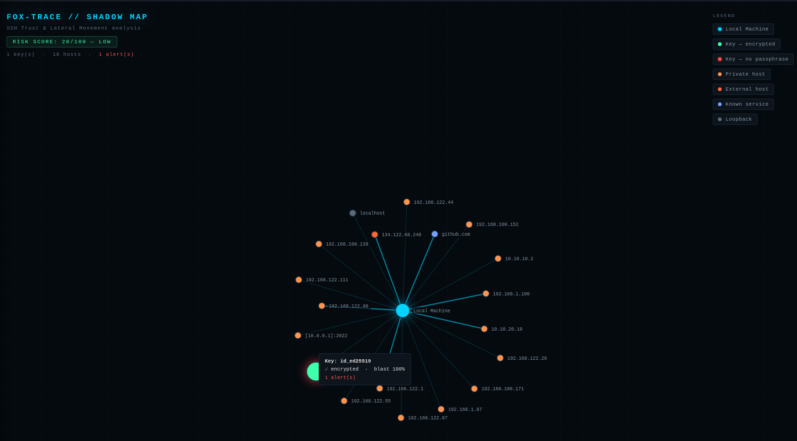

<p align="center">
  
</p>

<p align="center">
  <a href="LICENSE"></a>
  <a href="https://github.com/elin-olsson/fox-trace/actions/workflows/ci.yml"></a>
</p>

Fox-trace is a lightweight security tool designed to map and visualize SSH trust relationships on Linux systems.

Fox-trace identifies "Shadow Paths" — the potential routes an attacker could take to move laterally through a network by exploiting local SSH artifacts like keys, config files, and connection history.

## Prerequisites

- Python 3.10 or later
- No external packages required at runtime — stdlib only

Check your Python version:
```bash
python3 --version
```

## Installation

Clone the repository and navigate to the tool directory:
```bash
git clone https://github.com/elin-olsson/fox-trace.git
cd fox-trace
```

No dependencies to install. Run directly:
```bash
python3 src/harvester.py
```

## Usage

All commands below are run from inside the `fox-trace` directory:

```bash
cd fox-trace
```

```bash
python3 src/harvester.py [options]
```

```bash
# Run the harvester to scan the default ~/.ssh directory
python3 src/harvester.py

# Save results to a custom JSON path
python3 src/harvester.py --json data/custom_findings.json

# Generate the interactive Shadow Map (HTML)
python3 src/harvester.py --html

# Match keys against a GitHub user's public keys
python3 src/harvester.py --github elin-olsson

# Flag keys older than 90 days as stale
python3 src/harvester.py --stale 90

# Scan multiple hosts and detect circular trust relationships
python3 src/harvester.py --targets targets.txt --html
```


> **Note:** The `data/` directory is created automatically on first run. Output files (`findings.json` and `shadow_map.html`) are written there by default.

### Flags

| Flag | Description |
|---|---|
| `--version` | Print the version number and exit |
| `--json FILE` | Write structured findings to JSON |
| `--html [FILE]` | Generate interactive D3.js Shadow Map (optional path; defaults to `data/shadow_map.html`) |
| `--ssh-dir DIR` | Path to SSH directory to scan (default: `~/.ssh`) |
| `--github USER` | Match keys against GitHub public API |
| `--stale DAYS` | Flag keys older than X days (default: 180) |
| `--targets FILE` | Scan multiple hosts listed in FILE (one per line) and detect circular trust relationships |

## What it checks

Fox-trace performs a multi-stage audit of your SSH environment to uncover hidden risks.

| Check | How | Insight |
|---|---|---|
| **Private Keys** | Scans `~/.ssh/` for private key headers | Identifies the "passports" available on the system |
| **Key Strength** | Parses RSA modulus size, flags DSA | Detects cryptographically weak keys |
| **Passphrase** | Detects encryption in PEM and OpenSSH formats | Flags keys usable immediately if stolen |
| **Permissions** | Checks file and directory permissions | Warns on world-readable or group-readable keys |
| **Known Hosts** | Parses `known_hosts` (plain-text and hashed) | Maps destinations where this user has gone before |
| **Authorized Keys** | Reads fingerprints and comments | Identifies who has inbound access to this system |
| **Identity Match** | GitHub API correlation | Verifies if an anonymous key belongs to a known GitHub identity |
| **Active Agents** | Scans `/tmp/` for active SSH agent sockets | Warns of potential session hijacking risks |
| **Blast Radius** | Correlates SSH config with known hosts | Calculates how many servers a leaked key can access |
| **ForwardAgent** | Parses SSH config | Flags hosts where agent forwarding is enabled |

## Example output

```
══════════════════════════════════════════════════════════════
  FOX-TRACE  —  SSH Trust & Lateral Movement Mapper
══════════════════════════════════════════════════════════════
  Risk Score  ████████████████░░░░  60/100  [HIGH]
  Findings    34 artifacts identified

Found 1 private key(s).
Found 1 public key(s).
Found 1 authorized_keys entry(s).
Found 30 known host(s).
Found 0 active SSH agent(s).
~/.ssh permissions: 700 (OK)

--- Private Keys ---
  id_ed25519           ssh-ed25519  perm:600  NO PASSPHRASE  age:0d

--- Blast Radius Analysis ---
  id_ed25519 → 30 hosts (100.0%) [potential]

--- Risk Alerts & Remediations ---
  [HIGH  ] Key 'id_ed25519' has no passphrase — usable immediately if stolen.
           → Fix: Add a passphrase: ssh-keygen -p -f ~/.ssh/id_ed25519
  [HIGH  ] Key 'id_ed25519' blast radius 100.0% — 30 hosts (potential — no SSH config mapping).
           → Fix: Use per-host keys in ~/.ssh/config (IdentityFile). Audit and
             remove this key from authorized_keys on servers where it is no longer needed.

──────────────────────────────────────────────────────────────
  MOST CRITICAL ATTACK PATH
──────────────────────────────────────────────────────────────
  Key:          id_ed25519 (ssh-ed25519)
  Passphrase:   no passphrase — usable immediately if stolen
  Permissions:  600 (OK)
  Age:          0 days
  Blast Radius: 30 hosts (100.0%) — potential — no SSH config mapping found
  Example targets: github.com, 10.10.20.10, 192.168.1.100
══════════════════════════════════════════════════════════════
```

## Shadow Map Visualization

Fox-trace includes a built-in visualizer that generates an interactive, force-directed graph using **D3.js**.

```bash
python3 src/harvester.py --html
```



- **Local Machine** — the starting point of the audit, colored by risk score
- **SSH Keys** — nodes scaled by blast radius; green = passphrase protected, red = no passphrase
- **Known Hosts** — categorized by type: private IP, external IP, known service (GitHub), or loopback
- **Alerts** — click any node to see findings and exact remediation commands
- **Hover** — hover over any node for a quick summary without clicking
- **Zoom & drag** — scroll to zoom, drag nodes to rearrange, ESC to close the info panel

## Dependencies

No runtime dependencies — stdlib only.

| Package | Version | Purpose |
|---|---|---|
| `json` | stdlib | Data export and visualization input |
| `urllib` | stdlib | GitHub Public Key API communication |
| `hashlib` | stdlib | SSH key fingerprinting (SHA256) |
| `base64` / `struct` | stdlib | RSA key size parsing |
| `d3.js` | v7 (CDN) | Interactive graph rendering (via visualizer) |

---

<p align="center">
  <sub>The logo is &copy; 2026 shadowfox.se — all rights reserved, not covered by the MIT license.</sub>
</p>
