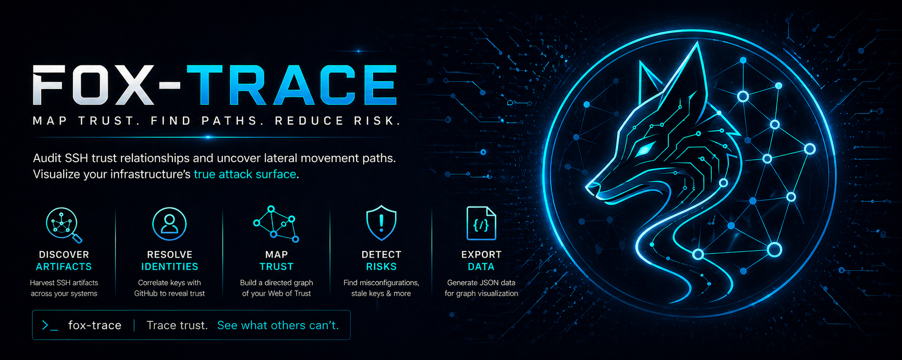

<p align="center">
  
</p>

# Fox-trace 🦊🕸️
**The SSH Trust & Lateral Movement Mapper**

Fox-trace is a lightweight security tool designed to map and visualize SSH trust relationships on Linux systems. By analyzing local SSH artifacts, it identifies "Shadow Paths" — the potential routes an attacker could take to move laterally through a network using existing keys and trust configurations.

---

## Key Features

- **The Harvester:** Recursively scans `~/.ssh/` for private keys, public keys, `authorized_keys`, and `known_hosts`.
- **Identity Matching:** Correlates local public keys with GitHub profiles using the GitHub Public Key API to identify anonymous keys.
- **Trust Mapping:** Identifies inbound trusts (who can access this host) and outbound paths (where this host can go).
- **Shadow Path Detection:** Flags potential lateral movement risks, such as active SSH agents or insecure key permissions.
- **JSON Export:** Generates structured data for visualization and auditing.

---

## Why Fox-trace?

Most lateral movement tools (like BloodHound or SSH-Snake) are designed for aggressive red-teaming. Fox-trace is built for the **defender**. It provides a clear, actionable overview of your network's "Web of Trust," allowing administrators to find and remove stale or unauthorized keys before they are exploited.

---

## Installation

```bash
git clone https://github.com/elin-olsson/fox-trace.git
cd fox-trace
```

*No external runtime dependencies required (uses standard Python libraries).*

---

## Usage

Run the harvester to scan your local environment:

```bash
python3 src/harvester.py
```

Results are displayed in the terminal and saved to `data/findings.json` for further analysis.

---

## Roadmap

- [x] SSH Artifact Harvesting
- [x] GitHub Identity Matching
- [x] JSON Data Export
- [ ] Interactive HTML Visualization (D3.js)
- [ ] SSH Agent Hijack Detection
- [ ] Stale Key Analytics

---

<p align="center">
  
</p>

&copy; 2026 shadowfox.se
